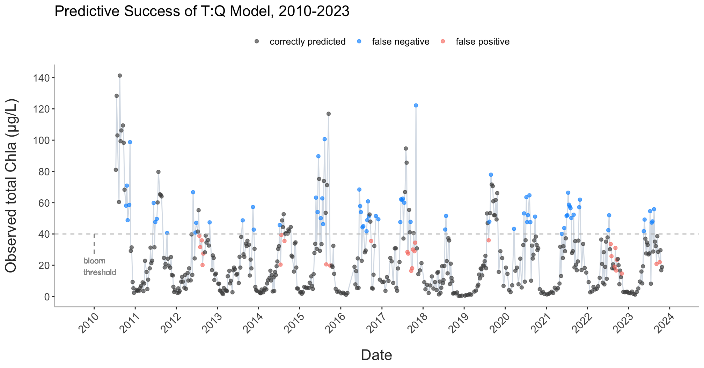

# README: PREDICTING ALGAL BLOOMS AS A FUNCTION OF TEMPERATURE-BASED RATIOS



## PROJECT OVERVIEW

This program takes long-term riverine/estuarine water monitoring data as input and models chlorophyll-a (CHLa) concentration using three logarithmic models and one nonlinear, tangential model:

```         
- ln(CHLa) ~ ln(temperature:discharge)
- ln(CHLa) ~ ln(temperature: discharge 4-day rolling average)
- ln(CHLa) ~ ln(temperature:inverse specific conductivity)
- CHLa ~ CHLamax * tanh((alpha * T:Q)/CHLamax)
```

The knitted HTML output contains tables with summary statistics for the all years in the data set; regression statistics for all years and also individual years, by model; model plots with best fit line; model specific time series plots; and time series plots for CHLa and dissolved organic nitrogen.

The script is designed to dynamically adapt to changes in the dataset, accommodating new data from subsequent years without requiring manual updates to its structure or content.

## SETUP AND IMPLEMENTATION

### ENSURE CORRECT WORKING DIRECTORY

1.  All the contents of the received zipped folder should be extracted to a single folder.

2.  **Open the R Project File:** - Locate the file named `algal-blooms.Rproj` within the extracted folder and open it.

3.  **Check the Current Working Directory:** - In the RStudio console, you can check the current working directory using the command `getwd()`. - Ensure that the current working directory is set to the location where you extracted the project files. If it's not, proceed to the next step.

4.  **Set the Working Directory:** - To set the working directory to the location of the project files, you can use the following command in the RStudio console:

    ```         
      `setwd("path/to/your/extracted/folder")`
    ```

5.  **Verify the Working Directory:** - Run `getwd()` again to confirm that the working directory has been set correctly.

### FILES

The following files are included in the original zipped project folder and should all be kept together in the project working directory.

```         
- 'algal-blooms.Rproj'  (R project file)
- 'CHLA_script.rmd'  (R Markdown file containing analysis script)
- 'CHLa_data.xlsx'  (source data Excel workbook file)
- 'functions.R'  (R script containing custom functions, including documentation on use)
- 'README.md' 
- 'Img'  (folder containing image files)
- 'output'  (folder that contains script output, e.g., csv, jpeg files)
- `CHLa_script.html'  (most recent knitted HTML output)
```

### REQUIRED PACKAGES

This program requires the following packages. An installation procedure has been written into the script.

```         
- `tidyverse`
- `ggplot2`
- `kableExtra`
- `openxlsx`
- `zoo`
```

## DATA

The script expects to read in an Excel workbook file with 3 tabs:

```         
- tab 1: ReadMe
- tab 2: table with rows corresponding to weekly observations and the following columns:

colnames(df.james)
[1] "date"        "site"        "SurfaceTemp"
[4] "CHLa"        "DIN"         "SpCond"     
[7] "InvSpCond"   "TtoCond"  

- tab 3: table with rows corresponding to days of year (1-365) and the following columns:

> colnames(df.discharge)
 [1] "DOY"  "2010" "2011" "2012" "2013" "2014" "2015"
 [8] "2016" "2017" "2018" "2019" "2020" "2021" "2022"
[15] "2023"
```

The script assumes that columns 3-5 in tab 2 of the Excel file correspond to surface temperature, CHLa, and DIN, in that order. Column indexing and specific column names can be modified at line 57 of the CHLA_script file:

```         
`colnames(df.james)[3:5] <- c("SurfaceTemp", "CHLa", "DIN")`
```

## CODE STRUCTURE

Custom functions are used throughout to simplify, streamline and reduce the amount of code in the main script. The use of custom functions is annotated in the script. The underlying code and documentation on their usage are contained in the `functions.R` file.

The script can be most easily navigated using either (1) the OUTLINE functionality, for moving between designated sections and subsections, or (2) the "chunk table of contents." The latter allows for more precise navigation within the document by choosing a specific code chunk. (See red outlines below)


The code is highly modular. After reading in data and generating CHLa and DIN time series plots, each of the following four sections (one per model) follows nearly the same structure. This is less the case with the final (nonlinear) model due to its more complex model formula and the need for additional arguments. As a result, fewer custom functions are used with model 4.

## EXPORTING PLOTS

Once the script has been successfully executed, there are a few ways that plots can be exported and saved.

#### Export From Plot Window

Locate the plot in the RStudio Plots pane, using the left and right arrows to move between plots. Use the 'Export' button above the plot.


#### Saving Plots in Code

You can also export programmatically by writing in the following function immediately following the code that produced the desired plot.

`ggsave(filename = "output/name_of_plot.jpg", device = "jpeg", dpi = 300)`

`dpi` sets the resolution (dots per square inch). `device` (other output types include "pdf", "png")
